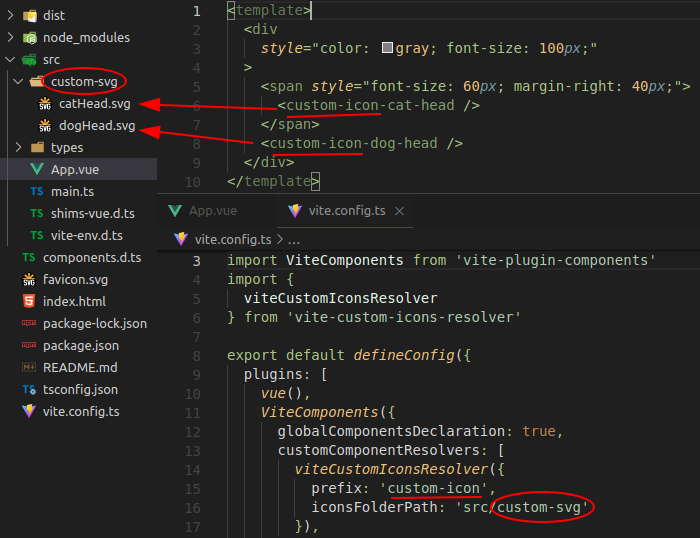

# vite-custom-icons-resolver

Resolver for the Vite config file is designed to create elementary vue components from custom svg icons.

Vue 3 and Vue 2 are supported.

_Examples of Vue custom component-icon using_ `vite-custom-icons-resolver`:



## Install

Before installing `vite-custom-icons-resolver`, you must install [_vite-plugin-components_](https://www.npmjs.com/package/vite-plugin-components), if it is not already installed.

```bash
    npm i -D vite-plugin-components
```

Install the plugin `vite-custom-icons-resolver`

```bash
    npm i -D vite-custom-icons-resolver
```

## Configure vite.config.js

Use with [vite-plugin-components](https://github.com/antfu/vite-plugin-components) (`>= v0.5.5`)

`vite-custom-icons-resolver` itself works as a parameter of the `vue-plugins-components` and does not depend on whether the 2nd or 3rd version of Vue is used.

Vue 3

```js
// vite.config.js (for Vue 3)
import Vue from '@vitejs/plugin-vue'
import Components from 'vite-plugin-components'
import { viteCustomIconsResolver } from 'vite-custom-icons-resolver'

export default {
  plugins: [
    Vue(),
    Components({
      customComponentResolvers: [
        viteCustomIconsResolver({
          prefix: 'custom-icon', // 'i' by default
          customIconsFolder: 'src/svg-icons', // 'src/icons' by default
        }),
      ],
    }),
  ],
}
```

Vue 2
Vita supports Vue 2 with a `vite-plugin-vue2` plugin.

```js
// vite.config.js (for Vue 2)
import { createVuePlugin } from 'vite-plugin-vue2'
import Components from 'vite-plugin-components'
import { viteCustomIconsResolver } from 'vite-custom-icons-resolver'

export default {
  plugins: [
    createVuePlugin(),
    Components({
      customComponentResolvers: [
        viteCustomIconsResolver({
          prefix: 'custom-icon', // 'i' by default
          iconsFolderPath: 'src/svg-icons', // 'src/icons' by default
        }),
      ],
    }),
  ],
}
```

`viteCustomIconsResolver` has two optional parameters:

- `prefix` has a default value of `'i'`. It can be an empty string.

- `customIconsFolder` specifies the path to the folder  where the svg icons files are located, and by default points to `src/icons` folder.

## Requirements for custom svg components

The name of custom svg components should be in the kebab case and look like this: `<prefix-name-of-svg-file />`. If `prefix` is empty string, the name of the component will be the same as the name of the corresponding svg file, converted to kebab like this: `<name-of-svg-file />`.

Custom svg components are global. They should not be registered and imported in the code of the parent component.

## Requirements for svg files

As mentioned above, each custom svg file must be placed in the folder specified via `customIconsFolder` parameter in the `vite.config.js` file or, if this parameter is skipped, in the `src/icons` folder by default.

The name of custom svg file can be in the `PascalCase`, `camelCase` or `kebab-case`, and must correspond to the name of component without a prefix.

Note that icons are mounted to page as inline `svg`. `vite-custom-icons-resolver` wraps svg content in `<template>` tag and saves the resulting component in the file with extension `.vue` in special service folder.

__Note__: Inline svg must not contain declaration tag
`<?xml ... ?>`
This tag, if it is present in custom svg file, is necessary to delete manually.

### Managing size and color

The svg in the component will be displayed exactly as in the file.

If you need to manage the size or color, you should prepare `svg` document for this.

#### Size

To control icon size using the css `font-size` property you should set the value of the attributes `width` and `height` equal to `1em` in the svg header.

```xml
<svg xmlns="http://www.w3.org/2000/svg" width="1em" height="1em" ...>
```

#### Color

To control the color of the svg icon using css, you need to prepare the svg document in a certain way (this applies only to single-color icons).

1. You should get rid of paths with a non-zero `stroke`. To do this, all paths with a non-zero `stroke` should be converted to shapes. This can easily be done in a vector graphics editor such as [_Inkscape_](https://inkscape.org/).

2. You need to remove all `fill`, both attributes and style parameters in the svg document. In most cases, you can also delete all the `style` attributes. Value of fill svg icon will receive from the parent component.

3. In the header of svg document you should specify the fill="currentColor":

```xml
<svg xmlns="http://www.w3.org/2000/svg" fill="currentColor" ...>
```

After these transformations of svg document you can use the css `color` property to control the icon color.

To optimize the resulting svg file (compression, removal of unnecessary information), you can use the [_svgo_](https://github.com/svg/svgo) utility.

## Source of inspiration

The source of inspiration for writing this module, which creates components from custom svg icons, was the technology of [_vite-plugin-icons_](https://www.npmjs.com/package/vite-plugin-icons) with [_iconify_](https://icon-sets.iconify.design/) for free icon sets.
